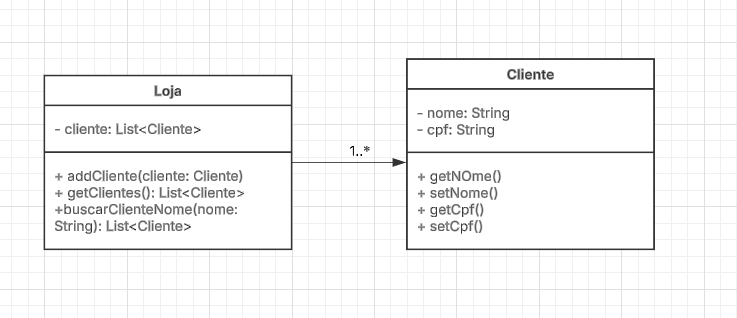

# bertoti

## 1. Comentar com suas palavras o primeiro trecho do livro Software Engineering at Google, Oreilly.

O primeiro trecho fala sobre as diferenças entre "engenharia de software", "programação" e "ciência da computação". Enquanto programação é basicamente escrever código, engenharia de software envolve o uso de conhecimento teórico para criar sistemas que funcionemem um bom estado. O autor compara isso com outras áreas da engenharia, destacando que a engenharia de software ainda não tem a mesma rigidez. Com a crescente importância do software, o autor sugere que é hora de adotar práticas mais rigorosas. 

## 2. Comentar com suas palavras o segundo trecho do livro Software Engineering at Google, Oreilly.

O segundo trecho aborda questões que são frequentemente difíceis na área de engenharia de software, como a manutenção de código a longo prazo e a adaptação a mudanças constantes. Além disso, fala sobre os três princípios (Tempo e Mudança, Escala e Crescimento, e Compromissos e Custos). Cada um desses princípios toca em um desafio real que todos nós enfrentamos em projetos de software, seja no momento da criação ou na manutenção. 

## 3. Listar e explicar 3 exemplos de tradeoffs.

### Custo x Qualidade:
Quando você compra um produto, frequentemente há um trade-off entre custo e qualidade. Um produto mais barato pode não ter a mesma qualidade de um produto mais caro, mas você economiza dinheiro ao escolher o mais barato.

### Velocidade x Precisão:
Ao treinar uma IA, você pode optar por um modelo mais rápido, mas menos preciso, ou um modelo mais preciso, mas mais demorado para treinar e usar.

### Privacidade x Conveniência:
Ao usar um aplicativo que coleta muitos dados pessoais, você pode obter uma experiência mais conveniente, mas isso vem com o custo de abrir mão da sua privacidade.

## 4. Classes UML.

      

## 5. JAVA.

### Cliente.java

<pre>package loja;

public class Cliente {
    private String nome;
    private String cpf;

    public Cliente(String nome, String cpf) {
        this.nome = nome;
        this.cpf = cpf;
    }

    public String getNome() {
        return nome;
    }

    public void setNome(String nome) {
        this.nome = nome;
    }

    public String getCpf() {
        return cpf;
    }

    public void setCpf(String cpf) {
        this.cpf = cpf;
    }
}</pre>

### Loja.java

<pre>package loja;

import java.util.LinkedList;
import java.util.List;

public class Loja {

    private List<Cliente> clientes = new LinkedList<Cliente>();

    public void addCliente(Cliente cliente) {
        clientes.add(cliente);
    }

    public List<Cliente> getClientes() {
        return clientes;
    }

    public List<Cliente> buscarClienteNome(String nome) {
        List<Cliente> encontrados = new LinkedList<Cliente>();

        for (Cliente cliente : clientes) {
            if (cliente.getNome().equals(nome))
                encontrados.add(cliente);
        }

        return encontrados;
    }
}</prec>

### Teste.java

<prec>package loja;

import static org.junit.jupiter.api.Assertions.*;
import java.util.List;
import org.junit.jupiter.api.Test;

class Teste {

    @Test
    void test() {
        Loja loja = new Loja();

        loja.addCliente(new Cliente("Carlos", "987654321"));

        assertEquals(loja.getClientes().size(), 1);

        List<Cliente> clientesEncontrados = loja.buscarClienteNome("Carlos");
        assertEquals(clientesEncontrados.get(0).getCpf(), "987654321");
    }
}
</prec>

## 6. Testes automatizados.

## TesteCliente.java

<prec>package loja;

import org.junit.jupiter.api.Test;
import static org.junit.jupiter.api.Assertions.*;

public class TesteCliente {

    @Test
    public void testConstrutor() {
        Cliente cliente = new Cliente("João", "123.456.789-00");
        assertEquals("João", cliente.getNome());
        assertEquals("123.456.789-00", cliente.getCpf());
    }

    @Test
    public void testSetNome() {
        Cliente cliente = new Cliente("João", "123.456.789-00");
        cliente.setNome("Maria");
        assertEquals("Maria", cliente.getNome());
    }

    @Test
    public void testSetCpf() {
        Cliente cliente = new Cliente("João", "123.456.789-00");
        cliente.setCpf("987.654.321-00");
        assertEquals("987.654.321-00", cliente.getCpf());
    }
}</prec>

## TesteLoja.java

<prec>package loja;

import org.junit.jupiter.api.Test;
import static org.junit.jupiter.api.Assertions.*;

public class TesteLoja {

    @Test
    public void testConstrutor() {
        Cliente cliente = new Cliente("João", "123.456.789-00");
        assertEquals("João", cliente.getNome());
        assertEquals("123.456.789-00", cliente.getCpf());
    }

    @Test
    public void testSetNome() {
        Cliente cliente = new Cliente("João", "123.456.789-00");
        cliente.setNome("Maria");
        assertEquals("Maria", cliente.getNome());
    }

    @Test
    public void testSetCpf() {
        Cliente cliente = new Cliente("João", "123.456.789-00");
        cliente.setCpf("987.654.321-00");
        assertEquals("987.654.321-00", cliente.getCpf());
    }
}</prec>

## 7. JAVA SQLite.
## 8. Usar ollama4j.

### Ollama.java

<pre>import java.io.*;
import java.net.*;

public class Ollama {
    public static void main(String[] args) {
        try {
            // Usa 127.0.0.1 pois o log mostra que o Ollama escuta nesse IP
            URL url = new URL("http://127.0.0.1:11434/api/generate");
            HttpURLConnection conn = (HttpURLConnection) url.openConnection();
            conn.setRequestMethod("POST");
            conn.setRequestProperty("Content-Type", "application/json");
            conn.setDoOutput(true);

            // JSON correto segundo a API atual
            String jsonInput = """
                {
                  "model": "codellama:7b",
                  "prompt": "Escreva os cinco nomes mais populares do mundo",
                  "stream": false
                }
                """;

            try (OutputStream os = conn.getOutputStream()) {
                byte[] input = jsonInput.getBytes("utf-8");
                os.write(input, 0, input.length);
            }

            int status = conn.getResponseCode();
            System.out.println("HTTP Status: " + status);

            // Lê resposta (erro ou sucesso)
            InputStream responseStream = (status >= 200 && status < 300)
                    ? conn.getInputStream()
                    : conn.getErrorStream();

            try (BufferedReader in = new BufferedReader(new InputStreamReader(responseStream, "utf-8"))) {
                StringBuilder response = new StringBuilder();
                String line;
                while ((line = in.readLine()) != null) {
                    response.append(line.trim());
                }
                System.out.println("Resposta:");
                System.out.println(response.toString());
            }

        } catch (Exception e) {
            e.printStackTrace();
        }
    }
}</pre>
